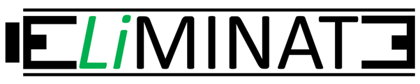

# About The Project

<!-- PROJECT LOGO -->
<br />
<div align="center">
  <a href="https://github.com/erikemilsson/ELiMINATE_EU_MFA">
    
  </a>

<h3 align="center">A Supplier-Facility-Customer facility optimization problem with linear programming.</h3>

</div>

<!-- ABOUT THE PROJECT -->
The code in the repository is based on the EU project <a href=https://www.vinnova.se/en/p/end-of-life-li-ion-battery-management-integration-and-technology-evaluation-eliminate/)https://www.vinnova.se/en/p/end-of-life-li-ion-battery-management-integration-and-technology-evaluation-eliminate/>ELiMINATE</a> in which a reverse-logistics network optimization was solved for the lithium-ion battery supply chain. 

The Supply and Demand Excel files were represented by the collectors and producers data (respectively):
<a href="https://chart-studio.plotly.com/~erikemilsson/23/#/">
  
</a>

<a href="https://chart-studio.plotly.com/~erikemilsson/5">
  
</a>

The results of the optimization were presented with maps, like here:

<a href="https://github.com/erikemilsson/ELiMINATE_EU_MFA/blob/main/example_images/optimization_novel1current1current2_CO2_2030.png">
  
</a>

To see more about the project, please refer to the report HERE.

<p align="right">(<a href="#readme-top">back to top</a>)</p>

### Built With

* <a href="https://pypi.org/project/PuLP">PuLP 2.7.0</a>
* <a href="https://opencagedata.com">OpenCage Geocoding API</a>
* <a href="https://plotly.com">plotly</a>
* <a href="https://mapbox.com">mapbox</a>

<p align="right">(<a href="#readme-top">back to top</a>)</p>


<!-- GETTING STARTED -->
## Getting Started

The repository and the sample data is currently applied to a forecast of the European battery market for 2030.
This is an example of how you may give instructions on setting up your project locally.
To get a local copy up and running follow these simple example steps.

### Installation

1. Get free APIs keys at
    - [mapbox](https://mapbox.com)
    - [OpenCage Geocoding API](https://opencagedata.com)
    - [openroute service](https://openrouteservice.org)
  
2. Clone the repo
   ```sh
   git clone https://github.com/erikemilsson/ELiMINATE_EU_MFA
   ```

3. Enter your API keys in `constantsfile.py`
   ```py
   api_key_opencage = "your-api-key-here"
   mapbox_access_token = "your-api-key-here"
   api_key_openrouteservice = "your-api-key-here"
   ```
   
4. Enter your data to
   - Demand.xlsx
   - Facilities.xlsx
   - Supplu.xlsx
   - constantsfile.py

  ### Running Optimization

1. Run Praparation.ipynb one time and install any necessary packages

2. Open Optimization.ipynb and add an integer value for 'number_of_facilities'

  ```py
  number_of_facilities = 
  ```
3. Run Optimzation.ipynb install any necessary packages


<p align="right">(<a href="#readme-top">back to top</a>)</p>


<!-- USAGE EXAMPLES -->
<!--
## Usage

Use this space to show useful examples of how a project can be used. Additional screenshots, code examples and demos work well in this space. You may also link to more resources.

_For more examples, please refer to the [Documentation](https://example.com)_

<p align="right">(<a href="#readme-top">back to top</a>)</p>
-->

<p align="right">(<a href="#readme-top">back to top</a>)</p>

<!-- CONTACT -->
## Contact

Erik Emilsson - erik.emilsson@ivl.se

Project Link: [https://github.com/erikemilsson/ELiMINATE_EU_MFA](https://github.com/erikemilsson/ELiMINATE_EU_MFA)

<p align="right">(<a href="#readme-top">back to top</a>)</p>
